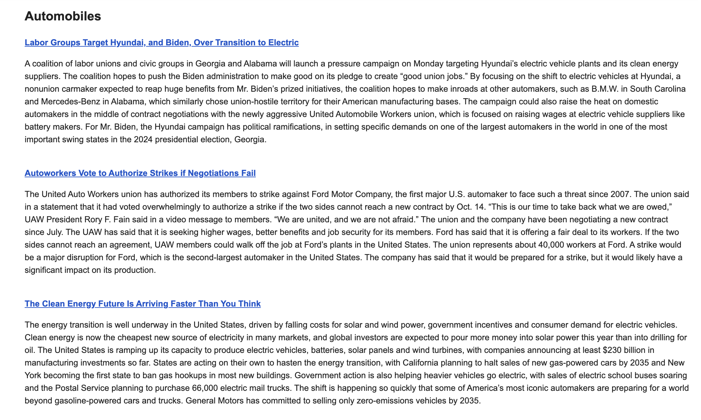

# Your Daily Rundown Frontend

This repository contains the frontend code for the YourDailyRundown newsletter app. The app allows users to effortlessly subscribe, unsubscribe, and customize their preferences for a daily newsletter curated to match their interests. It is crafted with React and styled using Chakra UI.

Backend Link: https://github.com/GiridharRNair/YourDailyRundownBackend  
Live Demo: https://giridharrnair.github.io/YourDailyRundown/

Example email of the automobile category:

## Tech Stack
* React: A JavaScript library for building user interfaces.
* Chakra UI: A simple, modular, and accessible component library for React.
* Axios: A promise-based HTTP client for making API requests.
* react-select: A flexible and customizable select input component for React.
* Typewriter: A library for creating typewriter-like animations.

## Installation and Setup
1. Clone the repository to your local machine and change into the working directory using `cd YourDailyRundown`.
2. Install the required dependencies using `npm install`.
3. Start the development server with `npm run dev`.
4. Access the app in your browser at `http://localhost:5173/YourDailyRundown/`.

## License
This project is licensed under the MIT License.
Feel free to contribute to this project by opening issues or pull requests.